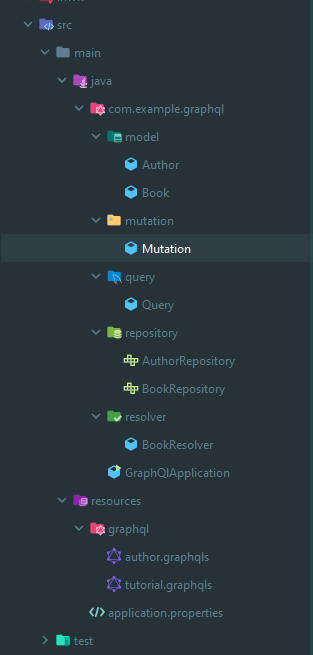
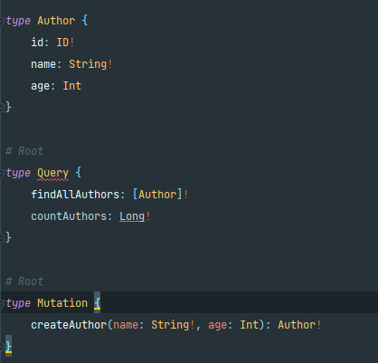
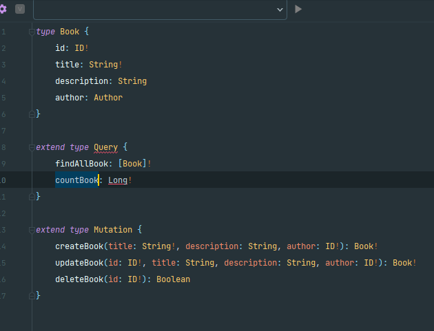
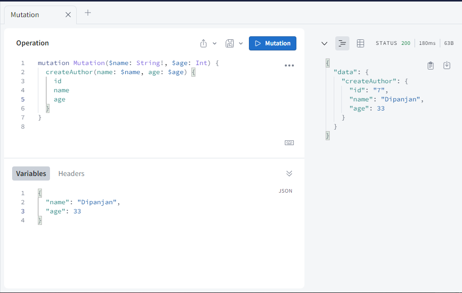
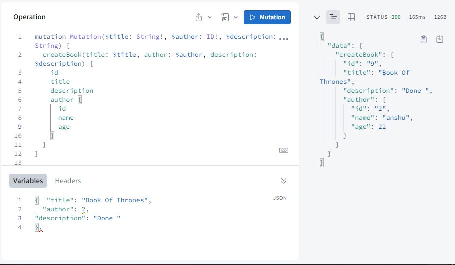
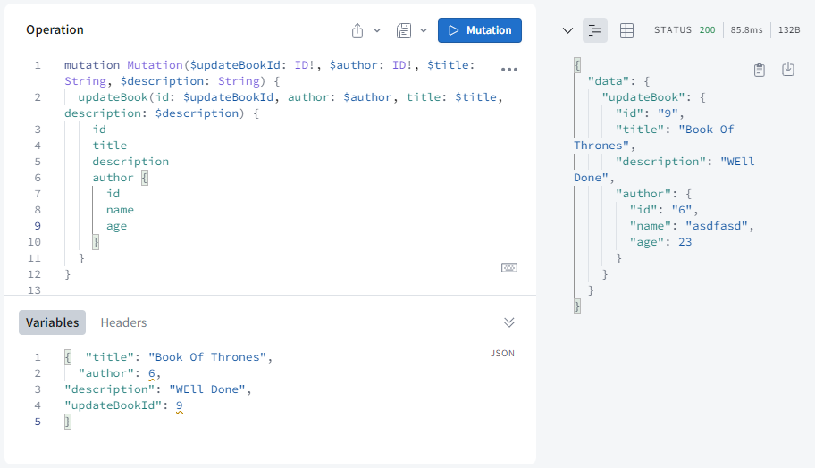
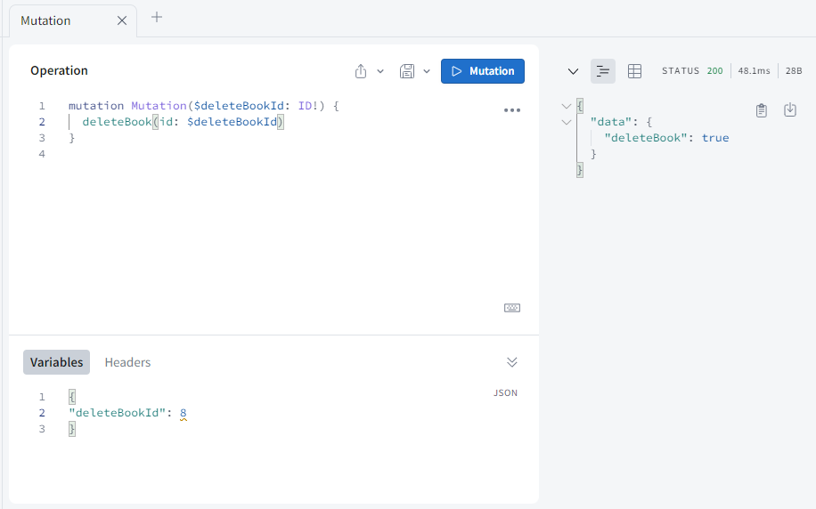
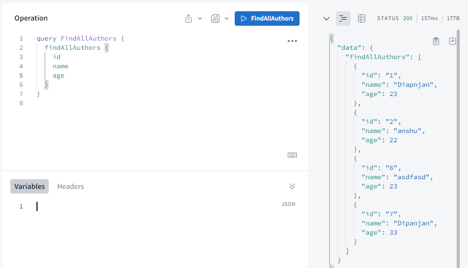
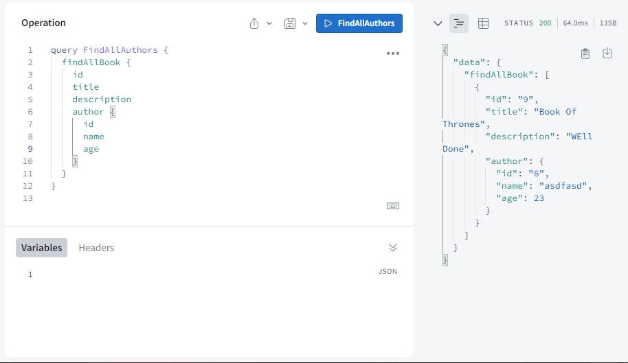
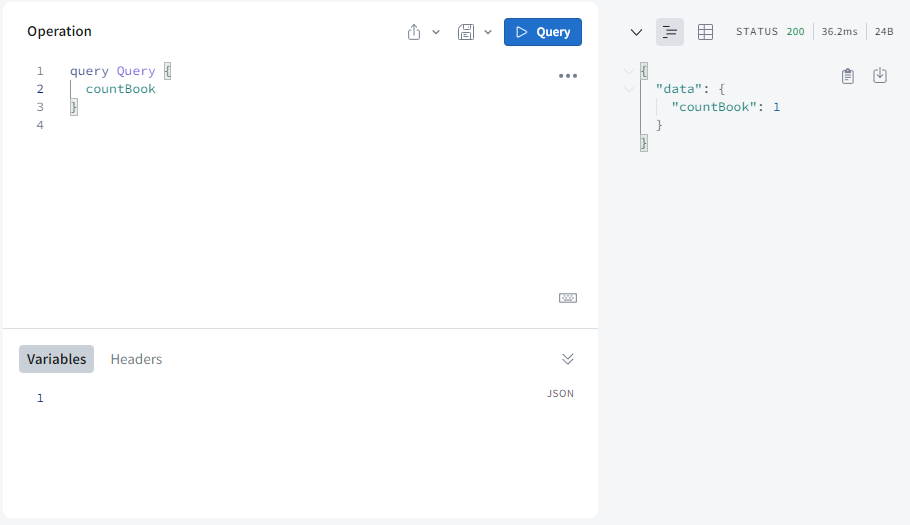

# Project Title

GraphQlApplication

## Description

Created a project where we can store the Book details along with Authors name with one-to-many relationship.

## Dependencies

- Spring Web
- Spring Data JPA
- Lombok
- Spring for GraphQL

## Project Structure

## Schema GraphQL file

Created our own Query using GraphQL:
- To read the data use -> Query
- to write you need to use -> Mutation

Author Schema

Book schema

## Query and Response

### Case 1: Create a record for Author

### Case 2: Create a record for Book

### Case 3: Update record for Book

### Case 4: Deleting a record of Book

### Case 5: Fetch all records of Authors

### Case 6: Fetch All Books

### Case 7: Count total no of Books

