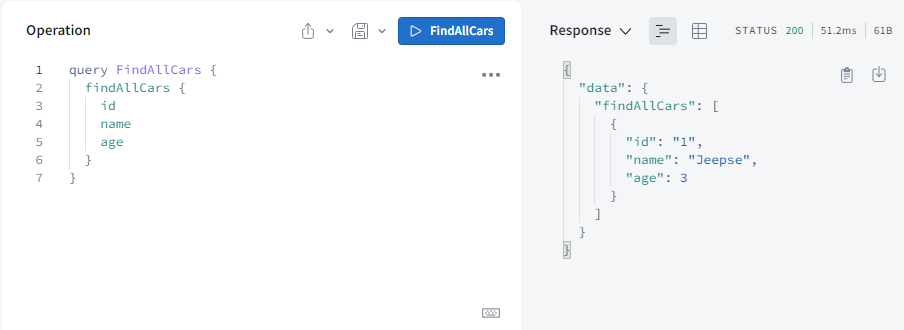

# Project Title

GraphQlApplication

## Description

Created a project where we can store the Book details along with Authors name with one-to-many relationship.

## Dependencies

- Spring Web
- Spring Data JPA
- Lombok
- Spring for GraphQL

## Project Structure

## Schema GraphQL file

Created our own Query using GraphQL:
- To read the data use -> Query
- to write you need to use -> Mutation

Car Schema

Owner Schema

## Query and Response

### Case 1: Create a record for Car

### Case 2: Create a record for Owner

### Case 3: Update record for Owner

### Case 4: Deleting a record of Owner

### Case 5: Fetch all records of Car

### Case 6: Fetch All Owners

### Case 7: Count total no of Cars

